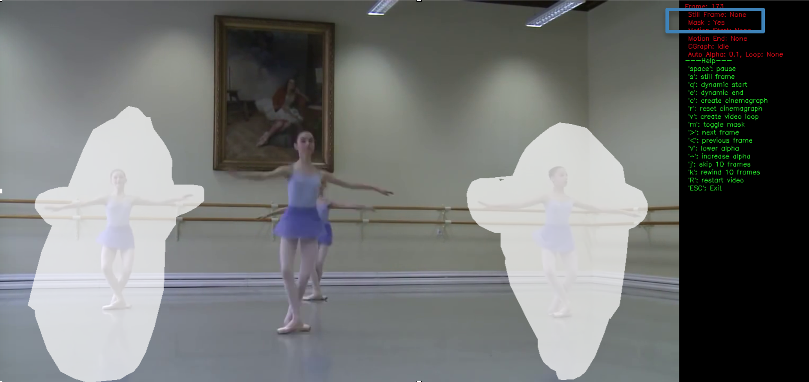

# Semi-Automated Cinemagraphs

## Pipeline

## Sample

Input:  

Mask:  

Result:  

## Input constraints
- It is assumed that the input video is stabilized (using a tripod or other means).
- Video with low spatial motion but interesting temporal changes is ideal.
- A small video with low to moderate resolution is preferred for performance.

## Usage
main.py [-h] -v VIDEO [-l BLEND] [-a ALPHA]

optional arguments:  
  -h, --help show this help message and exit  
  -v VIDEO, --video VIDEO  cinemagraph input video  
  -l BLEND, --blend BLEND laplacian blending levels (default: 4)  
  -a ALPHA, --alpha ALPHA disable video texture auto alpha selection (default: "automatic")  

e.g.: python main.py -v ./input/sample/sample.mp4

## Interface
Once the tool is launched, a prehistoric user interface is presented. I haven't thoroughly tested, except for the usual workflow, so it's best to follow steps in the following sequence:

- Use "space" to pause the video, and "<" or ">" keys to navigate 1 frame, or "j" and "k" to navigate 10 frames.
- Scan through video and select an interesting dynamic object by **painting a mask** around it. This mask selects a dynamic part of the video.
- Select a still image by pressing **"s"**. This will held constant throughout the cinemagraph while updating dynamic region.
- Still and dynamic frames are blended in real-time and rendered (at low frame-rate). Modify mask if needed.
- It is recommended that you clip the video before creating the final loop (30-150 frames). Select start frame by pressing **"q"** and end frame by **"e"**.
- Press "c" to create cinemagraph. This will write blended files in an appropriate directory.
- Once "CGraph" state is "Ready", you can press **"v"** to create video loop.
- Wait while video texture "alpha" is auto calculated - this ultimately determines the loop length.
- Once finished, the final video loop is rendered in a separate window.
- If it looks good, save it as a gif by pressing **"y"**. Otherwise, try to tune "alpha" manually or change clip length, check "help menu" of the tool or README to learn how to do it.
- To reset the state and start over press **"r"**.

Video demo: https://youtu.be/UOUTLotaVAI

## Resources  
[1] Burt, Peter J., and Edward H. Adelson. "A multiresolution spline with application to image mosaics." ACM Transactions on Graphics (TOG) 2.4 (1983): 217-236.
[2] Schödl, Arno, et al. "Video textures." Proceedings of the 27th annual conference on Computer graphics and interactive techniques. ACM Press/Addison-Wesley Publishing Co., 2000.  
[3] Joshi, Neel, et al. "Cliplets: juxtaposing still and dynamic imagery." Proceedings of the 25th annual ACM symposium on User interface software and technology. ACM, 2012.  
[4] Walter Lim et al. “Cinemagraph: Automated Generation (CAG) Walter”.  

## Credits:
- Ballet video. Ballet flowers. https://www.youtube.com/watch?v=J9iXXoigZs8
- Ferris wheel timelapse. james morris. https://www.youtube.com/watch?
v=7jJBK4Nh8Ww
- Skateboard video. Grégory S. Rorive. https://www.youtube.com/watch? v=SyKbnOnkO_E
- OpenCV. Open source computer vision and machine learning software library. http://opencv.org/
- FFmpeg. A complete, cross-platform solution to record, convert and stream audio and video. https://ffmpeg.org/
